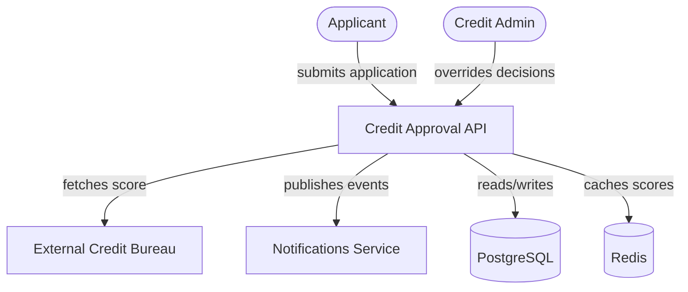
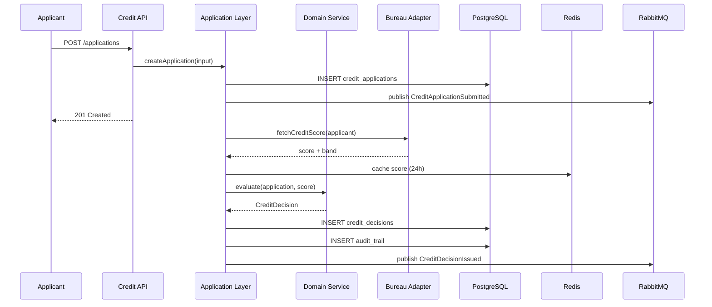
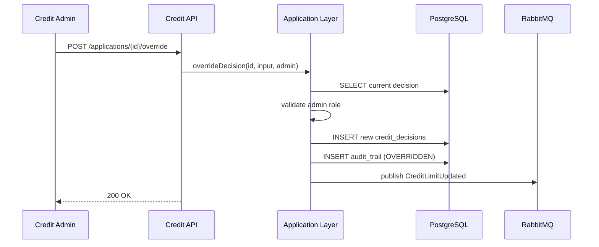

# Architecture Overview — Credit Approval Microservice

> **Mandatory reading for all agents before starting any task.**

## What Is This System

The Credit Approval Microservice is an automated system that evaluates credit applications from individuals in real time. It integrates with external credit bureaus to fetch scores, applies risk-based business rules, and issues immutable credit decisions with full audit trail compliance.

## Context Diagram (C4 - Level 1)

## Technology Stack

| Layer | Technology | Version | Justification |
|---|---|---|---|
| Backend | Node.js + Express | 20 LTS | Team expertise, fast startup, async I/O |
| Database | PostgreSQL | 16 | ACID compliance, JSONB for audit payloads, mature |
| Cache | Redis | 7 | Score caching, rate limiting, session storage |
| Messaging | RabbitMQ | 3.13 | Async evaluation, event publishing |
| Container | Docker | 25 | Consistent environments, easy local development |
| Orchestration | Docker Compose | 2.24 | Local stack, simple for demo/v1 |
| API Spec | OpenAPI 3.0 | 3.0.3 | Standard contract, generates client code |

## Architectural Principles

1. **Domain-Driven Design**: Code reflects the ubiquitous language. Aggregates protect invariants.
2. **Async-First for External Calls**: Bureau integrations are asynchronous to avoid blocking HTTP requests.
3. **Immutable Decisions**: Once issued, a credit decision cannot be altered — only superseded by a new decision with full audit trail.
4. **Defense in Depth**: Input validation at API layer, business rule validation in domain layer, database constraints at persistence layer.
5. **Observability by Default**: Every significant operation emits a structured log and metric.

## Module Boundaries

| Module | Responsibility | Depends On |
|---|---|---|
| `api` | HTTP layer, routing, validation, auth | `application`, `infrastructure` |
| `application` | Use cases, orchestration, DTOs | `domain`, `infrastructure` |
| `domain` | Entities, value objects, domain services, invariants | none (pure) |
| `infrastructure` | Repositories, external adapters, messaging, cache | `domain` |

## Main Flows

### Flow: Submit and Evaluate Application

### Flow: Manual Override

## Relevant Architectural Decisions

- [ADR-0001](../adr/0001-async-evaluation.md): Async evaluation instead of synchronous bureau calls
- [ADR-0002](../adr/0002-postgresql-over-mongodb.md): PostgreSQL chosen for ACID and JSONB flexibility
- [ADR-0003](../adr/0003-jwt-auth.md): JWT authentication with role-based access control

## What This System Does NOT Do

- **Identity verification / KYC**: Delegated to external IdentityProvider
- **Notifications**: Events are published; actual email/SMS is handled by Notifications Service
- **Credit limit usage tracking**: Out of scope for v1
- **Billing or payment processing**: Out of scope
- **Frontend UI**: This is a backend-only microservice

## Change History

| Date | Change | By |
|---|---|---|
| 2026-05-18 | Initial version | senior-architect |
