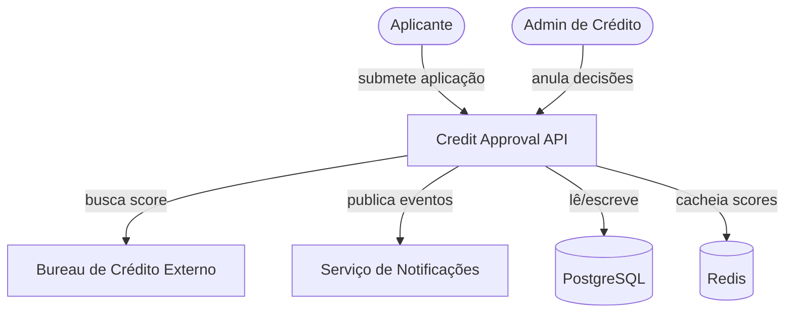
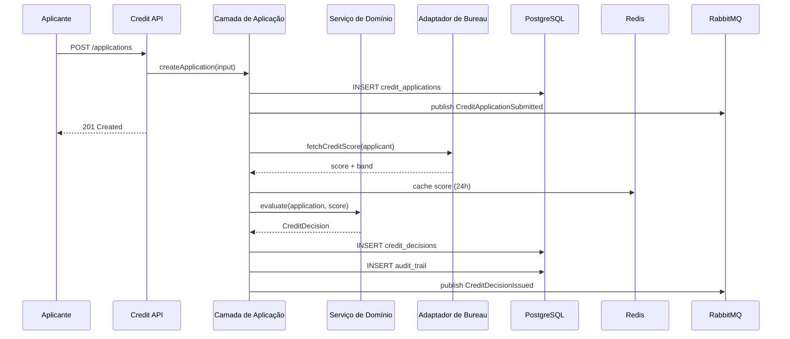
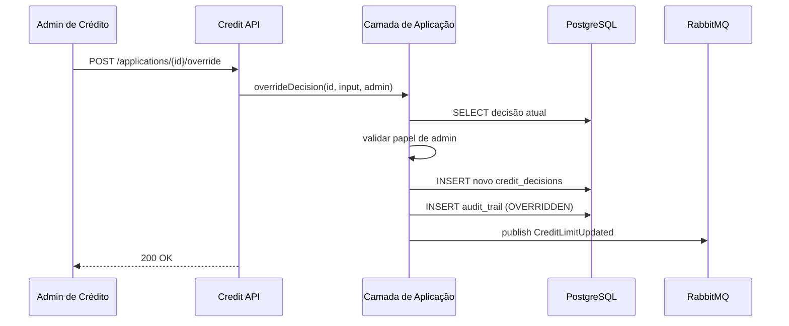

# Visão Geral da Arquitetura — Microserviço de Aprovação de Crédito

> **Leitura obrigatória para todos os agentes antes de iniciar qualquer tarefa.**

## O que é este sistema

O Microserviço de Aprovação de Crédito é um sistema automatizado que avalia aplicações de crédito de indivíduos em tempo real. Ele integra com bureaus de crédito externos para obter scores, aplica regras de negócio baseadas em risco e emite decisões de crédito imutáveis com trilha de auditoria completa.

## Diagrama de Contexto (C4 - Nível 1)

## Stack Tecnológica

| Camada | Tecnologia | Versão | Justificativa |
|---|---|---|---|
| Backend | Node.js + Express | 20 LTS | Expertise do time, startup rápido, I/O assíncrono |
| Banco de Dados | PostgreSQL | 16 | Compliance ACID, JSONB para payloads de auditoria, maduro |
| Cache | Redis | 7 | Cache de scores, rate limiting, armazenamento de sessão |
| Mensageria | RabbitMQ | 3.13 | Avaliação assíncrona, publicação de eventos |
| Container | Docker | 25 | Ambientes consistentes, desenvolvimento local fácil |
| Orquestração | Docker Compose | 2.24 | Stack local, simples para demo/v1 |
| Spec de API | OpenAPI 3.0 | 3.0.3 | Contrato padrão, gera código de cliente |

## Princípios Arquiteturais

1. **Domain-Driven Design**: O código reflete a linguagem ubíqua. Agregados protegem invariantes.
2. **Async-First para Chamadas Externas**: Integrações com bureau são assíncronas para evitar bloquear requisições HTTP.
3. **Decisões Imutáveis**: Uma vez emitida, uma decisão de crédito não pode ser alterada — apenas substituída por uma nova com trilha de auditoria completa.
4. **Defense in Depth**: Validação de entrada na camada de API, validação de regras de negócio na camada de domínio, constraints de banco na camada de persistência.
5. **Observabilidade por Padrão**: Toda operação significativa emite log estruturado e métrica.

## Limites de Módulos

| Módulo | Responsabilidade | Depende de |
|---|---|---|
| `api` | Camada HTTP, rotas, validação, auth | `application`, `infrastructure` |
| `application` | Casos de uso, orquestração, DTOs | `domain`, `infrastructure` |
| `domain` | Entidades, value objects, serviços de domínio, invariantes | nenhum (puro) |
| `infrastructure` | Repositórios, adaptadores externos, mensageria, cache | `domain` |

## Fluxos Principais

### Fluxo: Submeter e Avaliar Aplicação

### Fluxo: Anulação Manual

## Decisões Arquiteturais Relevantes

- [ADR-0001](../adr/0001-async-evaluation.md): Avaliação assíncrona em vez de chamadas síncronas ao bureau
- [ADR-0002](../adr/0002-postgresql-over-mongodb.md): PostgreSQL escolhido por ACID e flexibilidade JSONB
- [ADR-0003](../adr/0003-jwt-auth.md): Autenticação JWT com controle de acesso baseado em papéis

## O que este sistema NÃO faz

- **Verificação de identidade / KYC**: Delegado ao IdentityProvider externo
- **Notificações**: Eventos são publicados; email/SMS real é tratado pelo Serviço de Notificações
- **Rastreamento de uso de limite de crédito**: Fora do escopo do v1
- **Faturamento ou processamento de pagamentos**: Fora do escopo
- **Interface frontend**: Este é um microserviço backend-only

## Histórico de Alterações

| Data | Alteração | Por |
|---|---|---|
| 2026-05-18 | Versão inicial | senior-architect |
