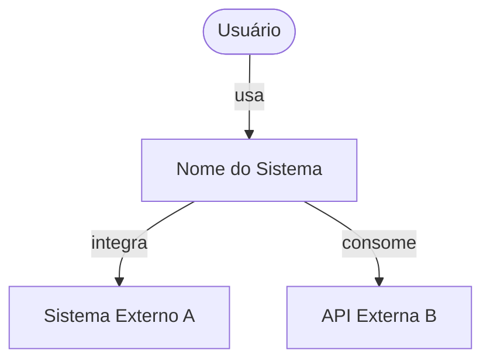
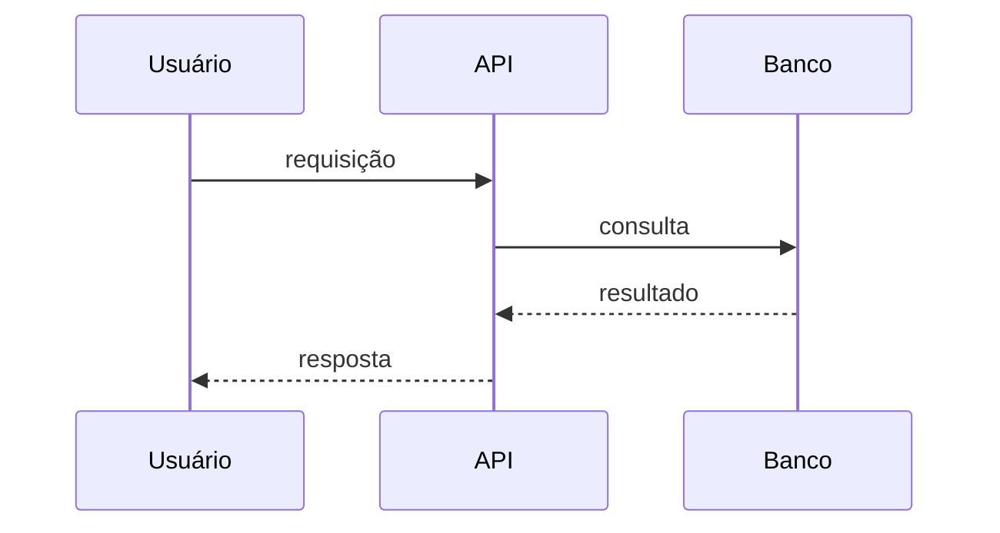

# Visão Geral da Arquitetura

> **Leitura obrigatória para todos os agentes antes de iniciar qualquer tarefa.**

## O que é este sistema

> Uma ou duas frases descrevendo o propósito do sistema.

## Diagrama de contexto (C4 - Nível 1)

## Stack tecnológica

| Camada | Tecnologia | Versão | Justificativa |
|---|---|---|---|
| Backend | | | |
| Frontend | | | |
| Banco de dados | | | |
| Cache | | | |
| Mensageria | | | |
| Infraestrutura | | | |

## Princípios arquiteturais

> Liste os 3-5 princípios que guiam as decisões técnicas deste projeto.

1. **[Princípio]**: [explicação]

## Fronteiras de módulos

> Quais são os principais módulos/serviços? Quais são suas responsabilidades e fronteiras?

| Módulo | Responsabilidade | Depende de |
|---|---|---|
| | | |

## Fluxos principais

> Descreva os 2-3 fluxos mais importantes do sistema.

### Fluxo: [nome]

## Decisões arquiteturais relevantes

> Liste as ADRs mais importantes para contextualizar o design atual.

- [ADR-0001](../adr/0001-exemplo.md): [título]

## O que este sistema NÃO faz

> Documente explicitamente o que está fora do escopo. Isso evita mal-entendidos entre agentes.

## Histórico de mudanças

| Data | Mudança | Por |
|---|---|---|
| YYYY-MM-DD | Versão inicial | arquiteto-senior |
