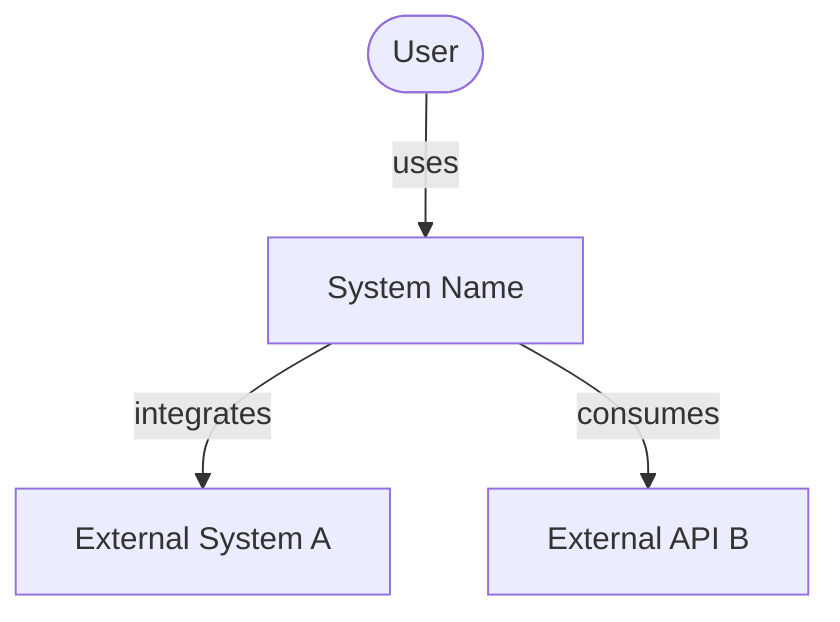
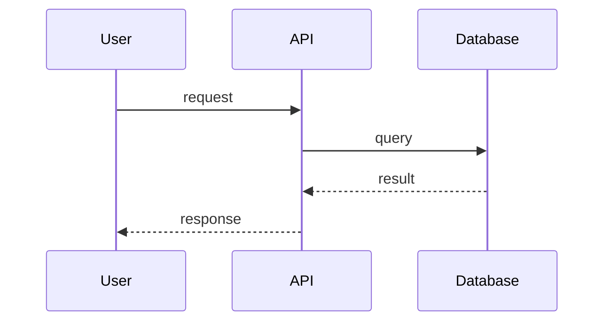

# Architecture Overview

> **Mandatory reading for all agents before starting any task.**

## What this system is

> One or two sentences describing the purpose of the system.

## Context diagram (C4 - Level 1)

## Technology stack

| Layer | Technology | Version | Rationale |
|---|---|---|---|
| Backend | | | |
| Frontend | | | |
| Database | | | |
| Cache | | | |
| Messaging | | | |
| Infrastructure | | | |

## Architectural principles

> List the 3-5 principles that guide the technical decisions of this project.

1. **[Principle]**: [explanation]

## Module boundaries

> What are the main modules/services? What are their responsibilities and boundaries?

| Module | Responsibility | Depends on |
|---|---|---|
| | | |

## Main flows

> Describe the 2-3 most important flows in the system.

### Flow: [name]

## Relevant architectural decisions

> List the most important ADRs to provide context for the current design.

- [ADR-0001](../adr/0001-example.md): [title]

## What this system does NOT do

> Explicitly document what is out of scope. This prevents misunderstandings between agents.

## Change history

| Date | Change | By |
|---|---|---|
| YYYY-MM-DD | Initial version | senior-architect |
