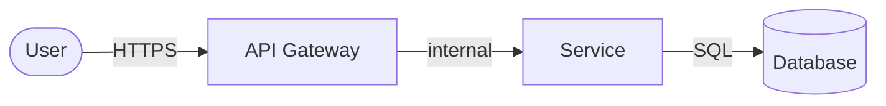

# Threat Model: [Component/Feature Name]

## Scope

> What is being analyzed? What are the system boundaries in this analysis?

## Data flow diagram

## Assets to protect

| Asset | Classification | Impact if compromised |
|---|---|---|
| [data/service] | `public` / `internal` / `confidential` / `restricted` | [description] |

## Identified threats (STRIDE)

| ID | Category | Threat | Component | Probability | Impact | Risk |
|---|---|---|---|---|---|---|
| T01 | Spoofing | [description] | [component] | `low/medium/high` | `low/medium/high` | `low/medium/high/critical` |
| T02 | Tampering | | | | | |
| T03 | Repudiation | | | | | |
| T04 | Info Disclosure | | | | | |
| T05 | Denial of Service | | | | | |
| T06 | Elevation of Privilege | | | | | |

## Implemented controls

| Threat | Control | Status |
|---|---|---|
| T01 | [control description] | `implemented` / `planned` / `accepted` |

## Accepted risks

| Threat | Justification | Approved by | Date |
|---|---|---|---|
| | | po | YYYY-MM-DD |

## Change history

| Date | Change | By |
|---|---|---|
| YYYY-MM-DD | Initial version | security-analyst |
