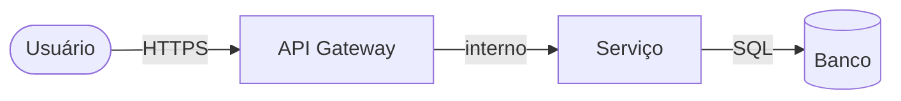

# Threat Model: [Nome do Componente/Feature]

## Escopo

> O que está sendo analisado? Quais são as fronteiras do sistema nesta análise?

## Diagrama de fluxo de dados

## Ativos a proteger

| Ativo | Classificação | Impacto se comprometido |
|---|---|---|
| [dado/serviço] | `público` / `interno` / `confidencial` / `restrito` | [descrição] |

## Ameaças identificadas (STRIDE)

| ID | Categoria | Ameaça | Componente | Probabilidade | Impacto | Risco |
|---|---|---|---|---|---|---|
| T01 | Spoofing | [descrição] | [componente] | `baixo/médio/alto` | `baixo/médio/alto` | `baixo/médio/alto/crítico` |
| T02 | Tampering | | | | | |
| T03 | Repudiation | | | | | |
| T04 | Info Disclosure | | | | | |
| T05 | Denial of Service | | | | | |
| T06 | Elevation of Privilege | | | | | |

## Controles implementados

| Ameaça | Controle | Status |
|---|---|---|
| T01 | [descrição do controle] | `implementado` / `planejado` / `aceito` |

## Riscos aceitos

| Ameaça | Justificativa | Aprovado por | Data |
|---|---|---|---|
| | | po | YYYY-MM-DD |

## Histórico de mudanças

| Data | Mudança | Por |
|---|---|---|
| YYYY-MM-DD | Versão inicial | security-analyst |
